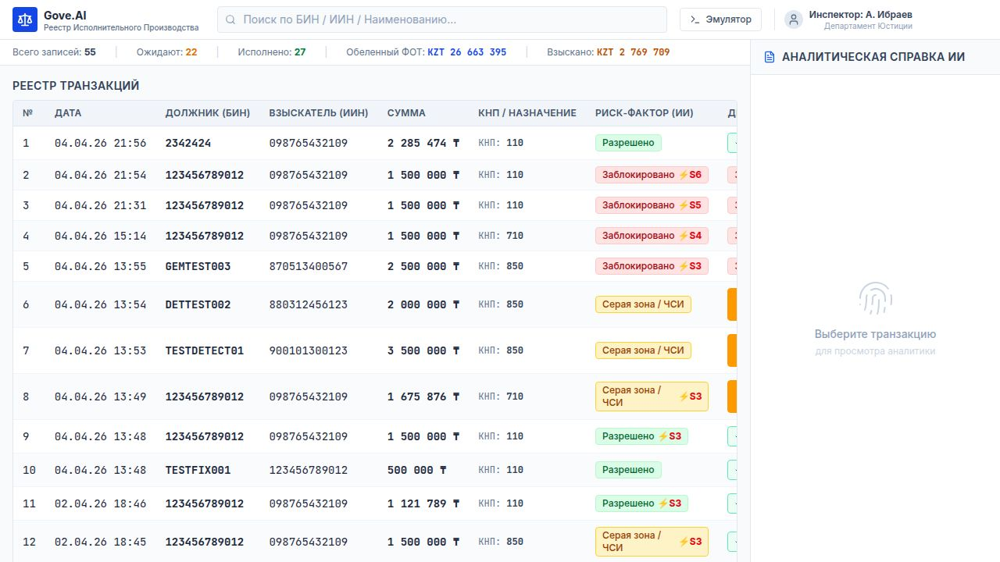

# Gove.AI | Copilot ЧСИ

> **AI-powered dashboard for Kazakhstani Bailiff Officers (ЧСИ)**  
> Автоматизированная система анализа транзакций с трёхуровневым ИИ-решением, интеграцией Solana Devnet и Telegram-уведомлениями.

---

## Скриншот



---

## О проекте

**Gove.AI** — это государственная GovTech-платформа, имитирующая работу банковского эмулятора для частных судебных исполнителей (ЧСИ) Казахстана. Система в реальном времени анализирует каждую исходящую транзакцию с помощью Google Gemini AI и принимает автоматическое решение по трём уровням.

### Трёхуровневая система решений

| Решение | Цвет | Действие |
|---------|------|----------|
| **ALLOW** | 🟢 Зелёный | Автоматически исполняется — Solana трансфер + Telegram уведомление |
| **GREY** | 🟡 Жёлтый | Заморожено — ожидает ручного подтверждения ЧСИ |
| **BLOCK** | 🔴 Красный | Автоматически блокируется — Strike++ + Telegram уведомление |

---

## Основные возможности

- **ИИ-анализ (Google Gemini 2.0 Flash)** — каждая транзакция проходит анализ с полным обоснованием решения
- **Банковский эмулятор** — интерфейс в стиле казахстанского банка с балансом, прогресс-баром ареста и историей
- **Incoming 15% Withholding** — при зачислении средств автоматически удерживается 15% (ст. 96 ЗК РК)
- **Solana Devnet** — реальные переводы 0.2 SOL на Devnet при каждом ALLOW-решении
- **Telegram-уведомления** — все события (ALLOW/GREY/BLOCK/Пополнение) отправляются в чат с AI-обоснованием
- **Strike System** — 3 страйка = CRITICAL_RISK статус должника
- **Реестр транзакций** — полный список с фильтрацией, поиском и кнопкой "Подтвердить ЧСИ" для серых зон
- **AI Copilot** — правая панель с аналитической справкой по каждой выбранной транзакции
- **Pre-analysis** — AI анализирует транзакцию в реальном времени пока пользователь вводит данные

---

## Технологический стек

### Frontend
- **React 18** + **TypeScript**
- **Vite** — сборщик
- **Tailwind CSS** + **shadcn/ui** — UI компоненты
- **TanStack Query** — state management и запросы к API

### Backend
- **Node.js** + **Express 5**
- **TypeScript** + **tsx** для hot-reload
- **node:sqlite** — встроенная база данных транзакций

### Интеграции
- **Google Gemini 2.0 Flash** — AI анализ транзакций
- **Solana Web3.js** — переводы на Devnet
- **Telegram Bot API** — уведомления
- **Supabase** — PostgreSQL (опционально)

---

## Архитектура

```
workspace/
├── artifacts/
│   ├── api-server/          # Express backend (порт 8080)
│   │   └── src/
│   │       ├── routes/
│   │       │   ├── analyze.ts    # POST /api/analyze — AI решение
│   │       │   ├── approve.ts    # POST /api/approve — подтверждение ЧСИ
│   │       │   ├── inflow.ts     # POST /api/inflow  — зачисление с 15% удержанием
│   │       │   └── transactions.ts # GET /api/transactions
│   │       └── lib/
│   │           ├── gemini.ts     # Google Gemini интеграция
│   │           ├── solana.ts     # Solana Devnet трансферы
│   │           ├── telegram.ts   # Telegram Bot уведомления
│   │           └── db.ts         # SQLite база данных
│   └── gove-ai/             # React frontend (порт 80)
│       └── src/
│           └── components/panels/
│               ├── EmulatorPanel.tsx   # Банковский эмулятор
│               ├── RegistryPanel.tsx   # Реестр транзакций
│               └── CopilotPanel.tsx    # AI Copilot аналитика
└── lib/                     # Shared типы и OpenAPI схема
```

---

## API Endpoints

### `POST /api/analyze`
Анализирует транзакцию и автоматически исполняет (ALLOW) или блокирует (BLOCK).

```json
{
  "amount": 500000,
  "description": "Оплата труда март 2026",
  "knp_code": "110",
  "receiver_iin": "123456789012",
  "debtor_bin": "BIN123456789"
}
```

**Ответ:**
```json
{
  "success": true,
  "transaction_id": "uuid",
  "decision": "allow",
  "reason": "Защищённый платёж — зарплата. КНП 110.",
  "strike_count": 0,
  "critical_risk": false,
  "message": "Транзакция исполнена автоматически."
}
```

### `POST /api/approve`
Подтверждение GREY-транзакции ЧСИ (только для `ai_decision === "grey"`).

```json
{ "transaction_id": "uuid" }
```

### `POST /api/inflow`
Имитация входящего платежа с удержанием 15%.

```json
{
  "amount": 500000,
  "description": "Поступление средств",
  "sender_bin": "BIN987654321"
}
```

### `GET /api/transactions`
Список всех транзакций с сортировкой по дате.

---

## Переменные окружения

Создайте файл `.env` в корне проекта:

```env
# Google Gemini AI
GOOGLE_API_KEY=your_gemini_api_key

# Solana
SOLANA_PRIVATE_KEY=your_base58_private_key
CREDITOR_PUBKEY=creditor_wallet_public_key

# Telegram
TELEGRAM_BOT_TOKEN=your_bot_token
TELEGRAM_CHAT_ID=your_chat_id

# Session
SESSION_SECRET=your_random_secret

# Supabase (опционально)
SUPABASE_URL=https://xxx.supabase.co
SUPABASE_KEY=your_supabase_anon_key
```

---

## Установка и запуск

### Требования
- Node.js 20+
- pnpm 9+

### Установка

```bash
# Клонировать репозиторий
git clone https://github.com/your-username/gove-ai.git
cd gove-ai

# Установить зависимости
pnpm install

# Создать .env файл и заполнить переменные
cp .env.example .env
```

### Запуск в разработке

```bash
# Запустить backend (порт 8080)
pnpm --filter @workspace/api-server run dev

# В отдельном терминале — запустить frontend (порт 5173)
pnpm --filter @workspace/gove-ai run dev
```

Открыть в браузере: `http://localhost:5173`

---

## Логика KNP кодов

| КНП | Тип | Решение |
|-----|-----|---------|
| 110, 111, 112 | Зарплата / налоги | ✅ ALLOW |
| 911, 10, 20, 30, 40 | Защищённые платежи | ✅ ALLOW |
| 850, 860 | Дивиденды / роялти | 🟡 GREY |
| 421, 220 | Подозрительные переводы | 🟡 GREY |
| Ключевые слова: обнал, родственник, вывод | Мошенничество | 🔴 BLOCK |

---

## Strike System

- Каждый **BLOCK** добавляет +1 страйк должнику
- При **3 страйках** — статус `CRITICAL_RISK`
- Telegram уведомляет о каждом страйке и критическом статусе

---

## Правовая основа

- **ст. 96 ЗК РК** — удержание 15% с входящих средств должника
- Система соответствует нормам Кодекса РК об исполнительном производстве

---

## Лицензия

MIT License — свободное использование в образовательных целях.

---

*Разработано с использованием Google Gemini AI, Solana Devnet и Telegram Bot API*
